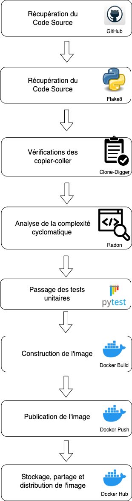

# TP3-CI

Documentation de la chaine d’intégration continue permettant de valider l’application avant de la packager dans une image de conteneur

## Description des fichiers fournis :

```
.
├── README.md
├── app
│   ├── application
│   │   ├── __init__.py
│   │   └── application.py
│   ├── command
│   │   ├── __init__.py
│   │   └── command.py
│   ├── machine
│   │   ├── __init__.py
│   │   ├── __pycache__
│   │   │   └── preview
│   │   │       ├── ImageIO
│   │   │       ├── Matplotlib
│   │   │       ├── OpenCV
│   │   │       ├── PIL
│   │   │       ├── Plotly
│   │   │       ├── Pytorch
│   │   │       └── Tensorflow
│   │   ├── machine.py
│   │   └── machines.json
│   ├── main.py
│   ├── requirements.txt
│   └── test
│       ├── __init__.py
│       ├── system
│       │   └── machine.robot
│       └── unit
│           ├── __init__.py
│           └── test.py
├── docker-app
│   └── python
│       └── Dockerfile
├── pipeline-ci-schema
│   ├── pipeline-ci.drawio
│   └── pipeline-ci.drawio.png
└── tp_3_CI.pdf
```

* README.md: Un fichier Markdown contenant la documentation et les informations importantes sur votre projet.
* app: Un répertoire contenant le code source de l'application. Il contient plusieurs sous-dossiers et fichiers, notamment :
* application: Un module Python contenant un fichier __init__.py et application.py.
* command: Un module Python contenant un fichier __init__.py et command.py.
* machine: Un module Python contenant un fichier __init__.py, machine.py, et un sous-dossier __pycache__ qui contient des fichiers en cache.
* main.py: Le fichier principal de votre application.
* requirements.txt: Un fichier spécifiant les dépendances Python nécessaires pour votre projet.
* test: Un dossier contenant les tests unitaires de votre application. Il contient un sous-dossier unit avec un fichier test.py.
* docker-app: Un répertoire contenant un fichier Dockerfile pour la construction d'une image Docker de l'application
* pipeline-ci-schema: Un répertoire contenant un schéma de pipeline CI
* tp_3_CI.pdf: Sujet du TP sous format PDF

## Description des pré-requis

Avant de mettre en place la chaîne d'intégration continue, assurez-vous d'avoir les éléments suivants :

    1- Un système d'automatisation des tâches, tel que Jenkins, GitLab CI ou GitHub Actions, installé et configuré sur votre infrastructure.
    2- Un dépôt Git contenant votre application Python. Assurez-vous d'avoir les droits d'accès nécessaires pour récupérer le code source à partir du dépôt.
    3- Une connexion au Docker Hub avec un identifiant et un mot de passe valides pour pouvoir pousser l'image Docker construite pendant le pipeline.
    4- Les dépendances et outils suivants doivent être installés sur votre système :
        - Python (version compatible avec votre application)
        - Docker
        - pytest
        - flake8
        - clone_digger (pour la vérification des copier-coller)
        - radon (pour l'analyse de la complexité cyclomatique)

## Schéma de présentation du déploiement :

Voici un schéma représentant les différentes étapes du pipeline d'intégration continue pour les applications Python :



Ce schéma présente les différentes étapes du pipeline d'intégration continue pour une application Python. Il commence par la récupération du code source à partir d'un référentiel Git, puis passe par les étapes de linter (vérification des normes de codage), de détection de copier-coller, d'analyse de la complexité cyclomatique, de tests unitaires et enfin de construction et de publication de l'image Docker sur le DOcker Hub.

Configuration des paramètres de pipeline :

Le pipeline d'intégration continue peut être configuré en modifiant certains paramètres. Voici les paramètres pouvant être personnalisés :

    1- URL du dépôt Git : Dans le fichier de pipeline (Jenkinsfile, .gitlab-ci.yml ou .github/workflows/main.yml), vous devez spécifier l'URL du dépôt Git contenant votre application Python. Assurez-vous de mettre à jour cette URL avec celle de votre dépôt.
    2- Paramètres des outils d'analyse de qualité : Certains outils d'analyse de qualité tels que Flake8, clone_digger et radon peuvent nécessiter des fichiers de configuration spécifiques. Assurez-vous de mettre à jour les chemins vers ces fichiers de configuration dans le pipeline en fonction de votre structure de répertoire.
    3- Chemin des tests unitaires : Dans le fichier de configuration des tests (pytest.ini), assurez-vous de spécifier le chemin correct vers les tests unitaires de votre application Python. Vous pouvez également personnaliser d'autres options de configuration de pytest selon vos besoins.
    4- Nom de l'image Docker et version : Dans le fichier Dockerfile, vous pouvez modifier le nom de l'image Docker en mettant à jour la ligne FROM python:3.9 avec l'image et la version souhaitées.
    5- Chemin et contexte du build de l'image Docker : Dans le fichier de pipeline (Jenkinsfile, .gitlab-ci.yml ou .github/workflows/main.yml), assurez-vous de spécifier le chemin correct vers le répertoire contenant le Dockerfile et les fichiers nécessaires pour la construction de l'image Docker. Cela peut être personnalisé en modifiant les paramètres context et dockerfile dans la section de construction de l'image.
    6- Identifiant de connexion pour le hub Docker : Dans le fichier de pipeline (Jenkinsfile, .gitlab-ci.yml ou .github/workflows/main.yml), vous devez spécifier l'identifiant de connexion pour le Docker Hub. Assurez-vous de mettre à jour cet identifiant avec le vôtre.

Assurez-vous de sauvegarder et de valider toutes les modifications apportées aux fichiers avant d'exécuter le pipeline d'intégration continue.

Ceci conclut la documentation pour la mise en place d'une chaîne d'intégration continue pour les applications Python. Suivez les instructions fournies pour configurer et exécuter votre pipeline d'intégration continue avec succès. Si vous rencontrez des problèmes ou avez des questions, n'hésitez pas à demander de l'aide à l'équipe DevOps ou à consulter la documentation supplémentaire appropriée pour les outils spécifiques utilisés (Jenkins, GitLab CI, GitHub Actions, etc.).
