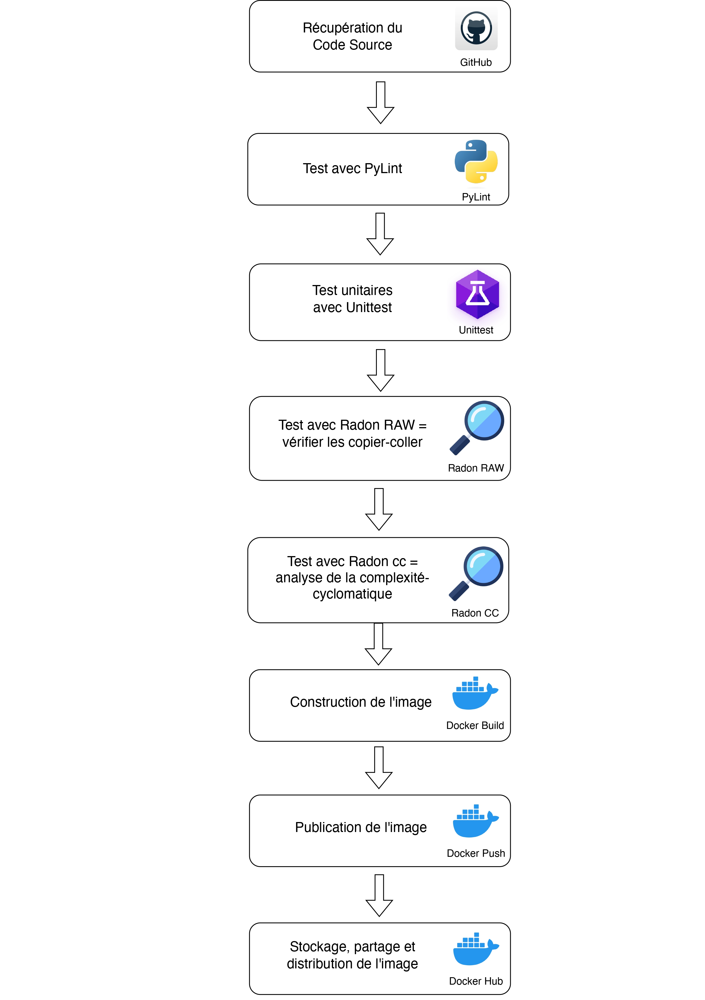

# Documentation du pipeline CI/CD pour une application Python

Ce document décrit le pipeline CI/CD pour une application Python. Il explique les étapes du pipeline, les fichiers nécessaires et la configuration des paramètres.

## Descriptions des fichiers fournis

Les fichiers suivants sont nécessaires pour le pipeline CI/CD :

- `.gitlab-ci.yml` : ce fichier définit les étapes du pipeline CI/CD (clone-repo/test/build)
- `config.toml`: ce fichier définit les paramètres du runner gitlab.`
- `docker-compose.yml` : ce fichier définit les 2 conteneurs (gitlab et gitlab-runner) nécessaires pour exécuter le pipeline CI/CD.
- `pipeline-ci-schema/pipeline-ci.jpg` : Schéma visuel d'un pipeline d'intégration continue.
- `tp_3_CI.pdf` : Document de présentation du TP3.

``` bash
. # arborescence du projet
├── README.md
├── config.toml
├── docker-compose.yml
├── pipeline-ci-schema
│   └── pipeline-ci.jpg
└── tp_3_CI.pdf
```

2 directories, 5 files

## Schéma visuel d'un pipeline d'intégration continue



## Configuration des paramètres

Les paramètres du pipeline CI/CD peuvent être configurés en définissant des variables dans le fichier `.gitlab-ci.yml`. Les variables suivantes sont disponibles :

- `GIT_REPO_URL`: L'URL du dépôt Git à cloner ou est stocké le code source de l'application.
- `GIT_REPO_PATH`: Le chemin où le dépôt Git sera cloné.
- `IMAGE_OS`: L'image Docker utilisée pour les jobs de la pipeline.
- `PYLINT_CONFIG_FILE`: Le chemin vers le fichier de configuration Pylint (peut être laissé vide si non utilisé).
- `PYLINT_REPORT_PATH`: Le chemin vers les rapports Pylint.
- `UNITTEST_FILE`: Le chemin vers le fichier de configuration Unittest.
- `REPO_APP_PATH`: Le chemin du repo de l'application à tester par les tests unitaires Unittest.
- `UNITTEST_REPORT_PATH`: Le chemin vers les rapports Unittest.
- `RADON_RAW_CONFIG_FILE`: Le chemin vers le fichier de configuration Radon Raw (peut être laissé vide si non utilisé).
- `RADON_RAW_REPORT_PATH`: Le chemin vers les rapports Radon Raw.
- `RADON_CC_CONFIG_FILE`: Le chemin vers le fichier de configuration Radon CC (peut être laissé vide si non utilisé).
- `RADON_CC_REPORT_PATH`: Le chemin vers les rapports Radon CC.
- `DOCKER_REGISTRY`: L'URL du registre Docker pour stocker l'image Docker (par défaut, "docker.io" est le registre Docker public).
- `DOCKER_REPO`: Le nom du repository Docker qui va stocker l'image Docker.
- `DOCKER_IMAGE_VERSION`: Le nom de la version de l'image construite et poussée sur le Hub Docker.
- `DOCKER_USER`: Le nom d'utilisateur du compte Docker Hub.
- `IMAGE_FILE`: Le chemin vers le fichier de configuration de l'image Docker (Dockerfile).
- `DOCKER_IMAGE_PATH`: Le chemin où l'artifact de l'image Docker sera enregistré.

## Étapes du pipeline

Le pipeline CI/CD est composé des étapes suivantes :

1. Récupération du code source : le code source de l'application est récupéré à partir d'un dépôt Git.
2. Linting : le code source est vérifié pour s'assurer qu'il respecte les normes de codage.
3. Vérification des copier-coller : le code source est vérifié pour détecter les copier-coller.
4. Analyse de la complexité cyclomatique : la complexité cyclomatique du code source est analysée.
5. Tests unitaires : les tests unitaires de l'application sont exécutés.
6. Construction de l'image Docker : une image Docker de l'application est construite.
7. Push de l'image Docker sur Docker Hub : l'image Docker construite est poussée sur Docker Hub.

Le pipeline est composé de 3 étapes : setup (configuration), test (test), et deploy (déploiement) :

1. setup (configuration) :

    - Cette étape installe Git pour cloner le dépôt Git spécifié dans la variable $GIT_REPO_URL.
    - Le dépôt Git est cloné dans le répertoire spécifié par la variable $GIT_REPO_PATH.
    - Le répertoire du dépôt cloné est archivé comme artefact pour une utilisation ultérieure.

2. test (test) :

    - pylint-test (test de pylint) :
        - Cette tâche installe les dépendances Python nécessaires.
        - Elle exécute pylint pour analyser le code Python et génère des rapports en JSON et en HTML.
        - Les rapports générés sont archivés comme artefacts.

    - unittest-test (test unittest) :
        - Cette tâche installe également les dépendances Python nécessaires.
        - Elle exécute les tests unitaires à l'aide de unittest avec le fichier spécifié dans la variable $UNITTEST_FILE.
        - Les rapports de test sont archivés comme artefacts.

    - radon-raw-test (test radon raw) :
        - Cette tâche installe des dépendances, y compris Radon, pour l'analyse de la complexité du code.
        - Elle exécute Radon pour générer des rapports sur la complexité du code en JSON et en HTML.
        - Les rapports générés sont archivés comme artefacts.

    - radon-cc-test (test radon cc) :
        - Cette tâche est similaire à radon-raw-test, mais elle analyse la complexité cyclomatique du code.
        - Les rapports générés sont archivés comme artefacts.

3. deploy (déploiement) :

    - Cette étape utilise l'image Docker pour construire et déployer l'application.
    - build-image (construction de l'image Docker) :
        - Cette tâche se connecte à Docker Hub avec les informations d'identification spécifiées.
        - Elle construit une image Docker à partir du fichier Dockerfile spécifié.
        - L'image Docker est ensuite poussée vers Docker Hub.

Globalement, ce fichier .gitlab-ci.yml définit un pipeline de CI/CD qui configure, teste et déploie votre application Python. Les différents tests (linting, unittest, analyse de la complexité du code) sont effectués pour assurer la qualité du code avant le déploiement de l'image Docker. Les rapports de test sont archivés pour un accès facile et la traçabilité des résultats.

## Fichiers de configuration Dockerfile dans le répertoire docker-app/python de l'application

Le fichier Dockerfile permet de construire une image Docker qui exécute une application Flask. Voici une brève analyse de ce Dockerfile :

1. Vous utilisez l'image de base officielle de Docker, python:3, qui contient Python 3.
2. Le répertoire de travail dans le conteneur est défini comme /app en utilisant la commande WORKDIR.
3. Tous les fichiers et répertoires du répertoire app/ de votre système hôte sont copiés dans le répertoire de travail du conteneur Docker à l'aide de la commande COPY.
4. Les dépendances Python spécifiées dans le fichier requirements.txt sont installées dans le conteneur Docker à l'aide de la commande pip install. L'option --no-cache-dir est utilisée pour garantir que les dépendances sont toujours installées à partir de la source plutôt que d'utiliser un cache local.
5. Vous définissez une variable d'environnement FLASK_APP avec la valeur "main". Cette variable est utilisée par l'application Flask pour spécifier le module principal de l'application.
6. Enfin, la commande CMD spécifie la commande qui sera exécutée lorsque le conteneur Docker est démarré. Dans ce cas, vous démarrez l'application Flask en utilisant python3 -m flask run --host=0.0.0.0, ce qui permet à l'application d'écouter sur toutes les interfaces réseau disponibles.

## Exécution du pipeline CI/CD

Pour exécuter ce pipeline sur GitLab, vous devez suivre ces étapes :

1. Placez-vous à l'endroit souhaité et y copier le repo suivant :

    ```bash
        git clone https://gitlab.com/JoffreyBENA/tp3-ci.git
    ```

2. Configurez une nouvelle variable d'environnement $GITLAB_HOME pointant vers le répertoire où se trouvera la configuration, les journaux et les fichiers de données. Assurez-vous que le répertoire existe et que les autorisations appropriées ont été accordées.

    - pour les utilisateurs Linux, définissez le chemin sur /srv/gitlab :

```bash
    export GITLAB_HOME = /srv/gitlab
```

- pour les utilisateurs macOS, utilisez le répertoire $HOME/gitlab de l'utilisateur :

```bash
    export GITLAB_HOME = $HOME /gitlab
```

3. Lancer le conteneur docker-compose :

``` bash
    docker-compose up -d
```

Cela peut prendre quelques minutes le temps de que les conteneurs finissent de se lancer. Vérifier leurs états en effectuant la commande :

``` bash
    docker-compose ps
```

Attendre ques les 2 conteneurs soient en état "Up".

4. Accéder a votre instance Gitlab en ouvrant votre navigateur et en entrant l'URL suivante : `http://localhost:8080`. Connectez-vous avec le nom d'utilisateur root et le mot de passe préalablement obtenu en faisant la commande :

    ``` bash
    docker exec -it gitlab-ce grep 'Password:' /etc/gitlab/initial_root_password
    ```

4. Afin de pouvoir importer un projet, suivez ces instructions :

    - Sign in to GitLab as a user with Administrator access level.
    - On the left sidebar, select **Search or go to**.
    - Select **Admin Area**.
    - Select **Settings > General**.
    - Expand the **Import and export settings** section.
    - Select each of **Import sources** to allow.
    - Select **Save changes**.

6. Créez un nouveau projet sur GitLab. Cliquez sur New Project (Nouveau projet) dans le menu de gauche, puis cliquez sur Import project (Importer un projet). Dans le champ "Git repository URL" (URL du dépôt Git), entrez l'URL du dépôt Git à cloner `https://gitlab.com/JoffreyBENA/tp3-ci.git`. Cliquez sur Create project (Créer un projet) pour créer le projet.

7. Vous devez modifier le fichier "config.toml" pour ajouter le token d'enregistrement du runner gitlab. Pour ce faire, allez dans votre projet sur GitLab, cliquez sur Settings (Paramètres) dans le menu de gauche, puis cliquez sur CI/CD. Déroulez la section Runners, copiez le token d'enregistrement et collez-le dans le fichier config.toml à l'emplacement dédié.

8. Ajouter une variables d'environnement sensible $DOCKER_TOKEN sur Gitlab :

    - Connecter vous a votre compte Docker Hub, cliquez sur votre avatar en haut à droite, puis cliquez sur **Account Settings** (Paramètres du compte). Dans le menu de gauche, cliquez sur **Security** (Sécurité), puis cliquez sur **New Access Token** (Nouveau jeton d'accès). Entrez un nom pour le jeton d'accès, puis cliquez sur **Create** (Créer). Copiez le jeton d'accès et conservez-le en lieu sûr.

    - Ensuite, allez dans votre projet sur GitLab, cliquez sur **Settings** (Paramètres) dans le menu de gauche, puis cliquez sur **CI/CD**. Déroulez la section **Variables**, ajoutez la variable $DOCKER_TOKEN et sa valeur (préalablement copié a l'étape précédente), puis cliquez sur Add Variable (Ajouter une variable).

9. Modifier les variables d'environnement du fichier `.gitlab-ci.yml` selon votre application et vos besoins. Concernant la variable DOCKER_REPO, il faut créer un repository sur Docker Hub, pour cela connecter vous sur Docker Hub, cliquez sur **Create Repository** (Créer un dépôt), entrez le nom du dépôt, puis cliquez sur **Create** (Créer). Vous pouvez maintenant modifier la variable DOCKER_REPO avec le nom du dépôt créé.

10. Avant de continuer, il vaut la peine de modifier quelques paramètres de Gitlab :

    - Tout d'abord, nous désactiverons l'enregistrement ouvert pour tout le monde. Pour ce faire, cliquez sur le bouton "Afficher les paramètres" disponible sur la barre supérieure avec un avertissement (adresse vers le panneau ; `http://localhost:8080/admin/application_settings/general#js-signup-settings` ). Sur la nouvelle page, décochez "Inscription activée" et enregistrez les modifications.

    - La prochaine étape devrait consister à changer l'utilisateur root. Pour ce faire, rendez-vous sur le site web: `http://localhost:8080/-/profile/account` et entrez le nom dans le champ Changer le nom d'utilisateur. Nous approuvons en cliquant sur Mettre à jour le nom d'utilisateur.

    - Ensuite, nous allons changer le mot de passe. Pour ce faire, rendez-vous sur le site web: `http://localhost:8080/-/profile/password/edit` et entrez le mot de passe dans le champ Changer le mot de passe. Nous approuvons en cliquant sur Mettre à jour le mot de passe.

11. Pour lancer la pipeline CI/CD, allez dans votre projet sur GitLab, cliquez sur CI/CD dans le menu de gauche, puis cliquez sur Pipelines. Cliquez sur Run Pipeline (Exécuter le pipeline) pour lancer le pipeline CI/CD :
    - Pour voir l’état de votre pipeline, allez dans votre projet sur GitLab, cliquez sur CI/CD dans le menu de gauche, puis cliquez sur Pipelines.

12. Pour voir les rapports de test, allez dans votre projet sur GitLab, cliquez sur CI/CD dans le menu de gauche, puis cliquez sur Jobs. Cliquez sur le job que vous souhaitez voir, puis cliquez sur l'onglet Artifacts. Vous pouvez télécharger les rapports de test à partir de là.

13. Pour voir l'image Docker construite, allez sur Docker Hub et connectez-vous avec les informations d'identification de votre compte Docker Hub. Vous devriez voir l'image Docker construite dans votre compte Docker Hub.

ENJOY !
